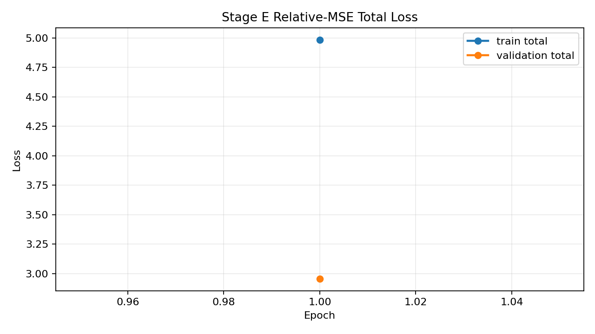
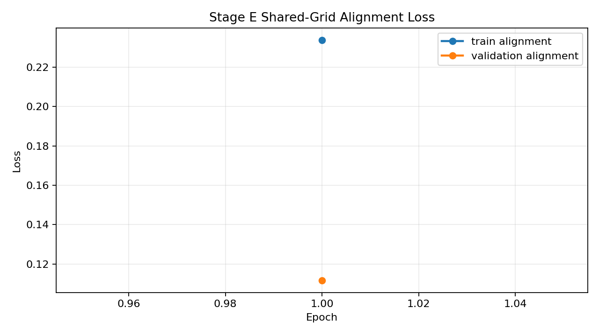
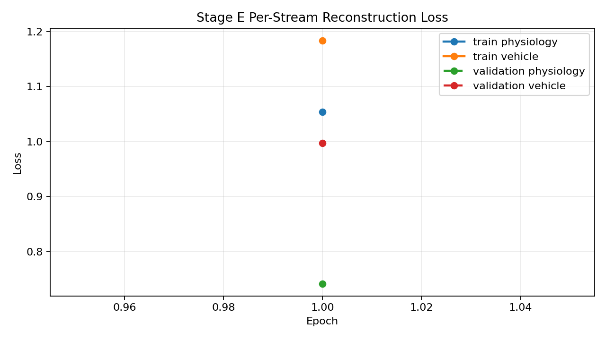
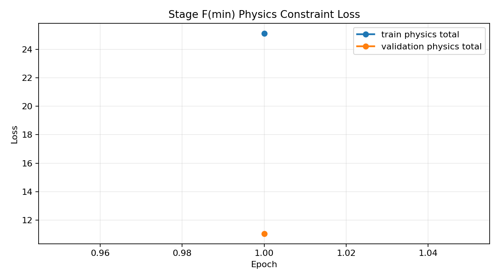
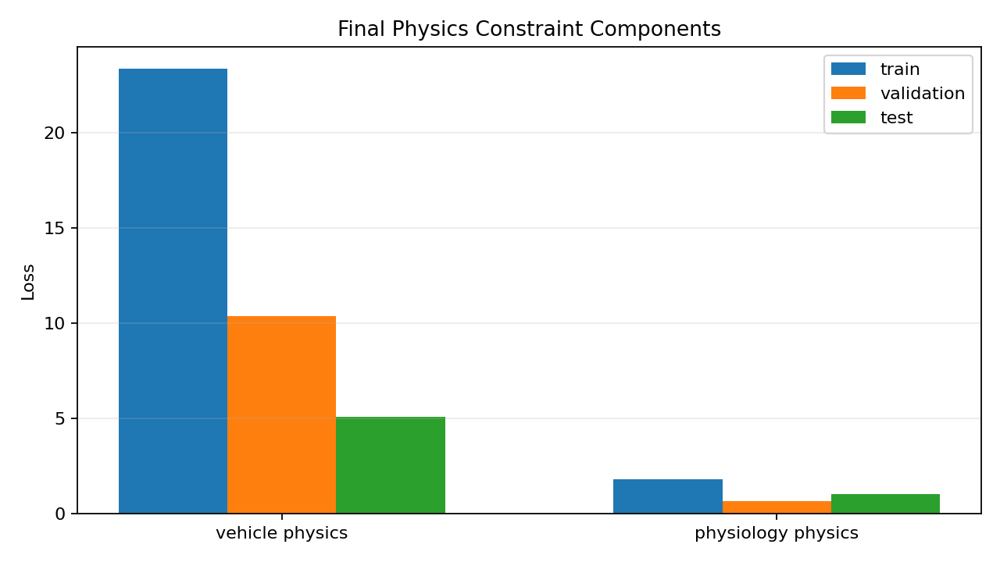
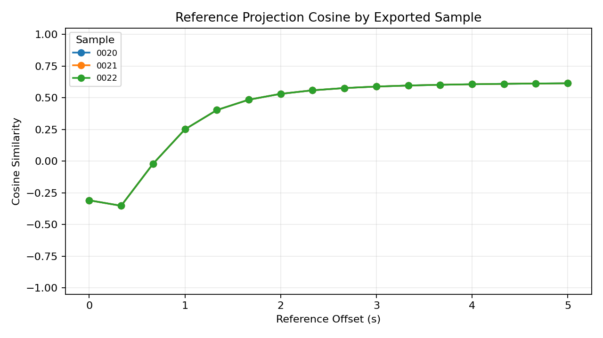

# Alignment Preview - 20251005_四01_ACT-4_云_J20_22#01

## Sample Summary

- sample count: `25`
- max physiology feature count: `12`
- max vehicle feature count: `21`

## Split Summary

- train: `15`
- validation: `5`
- test: `5`
- skipped between train/validation: `0`
- skipped between validation/test: `0`

## Selected Train Metrics

- physiology reconstruction: `1.053999`
- vehicle reconstruction: `1.184060`
- reconstruction total: `2.238060`
- alignment: `0.233866`
- vehicle physics: `23.342084`
- physiology physics: `1.786833`
- physics total: `25.128916`
- total: `4.984817`

## Selected Validation Metrics

- physiology reconstruction: `0.741586`
- vehicle reconstruction: `0.997548`
- reconstruction total: `1.739134`
- alignment: `0.111622`
- vehicle physics: `10.372714`
- physiology physics: `0.672516`
- physics total: `11.045230`
- total: `2.955279`

## Reference Intermediate Export

- partition: `test`
- exported sample count: `3`
- reference point count: `16`
- exported sample ids: `20251005_四01_ACT-4_云_J20_22#01:0020, 20251005_四01_ACT-4_云_J20_22#01:0021, 20251005_四01_ACT-4_云_J20_22#01:0022`
- physiology mean reference projection L2: `1.170811`
- vehicle mean reference projection L2: `1.206505`
- mean cross-stream projection cosine: `0.397057`

## Test Metrics

- physiology reconstruction: `0.769290`
- vehicle reconstruction: `0.992608`
- reconstruction total: `1.761899`
- alignment: `0.111622`
- vehicle physics: `5.079944`
- physiology physics: `1.025524`
- physics total: `6.105468`
- total: `2.484067`

## Physics Constraint Diagnostics

- enabled: `True`
- family: `rigid_body`
- mode: `feature_first_with_latent_fallback`
- vehicle metadata status: `loaded`
- vehicle metadata fields: `96`

| metric | train | validation | test |
| --- | ---: | ---: | ---: |
| vehicle physics | 23.342084 | 10.372714 | 5.079944 |
| physiology physics | 1.786833 | 0.672516 | 1.025524 |
| physics total | 25.128916 | 11.045230 | 6.105468 |

### Component Breakdown

| component | train | validation | test |
| --- | ---: | ---: | ---: |
| physiology_envelope | 0.000000 | 0.000000 | 0.000000 |
| physiology_latent | 0.812019 | 0.197289 | 0.197289 |
| physiology_pairwise | 0.071244 | 0.057824 | 0.071834 |
| physiology_smoothness | 0.903570 | 0.417403 | 0.756401 |
| physiology_spo2_delta | 0.000000 | 0.000000 | 0.000000 |
| vehicle_envelope | 0.000000 | 0.000000 | 0.000000 |
| vehicle_latent | 0.000000 | 0.000000 | 0.000000 |
| vehicle_rigid_body_rotation | 0.000000 | 0.000000 | 0.000000 |
| vehicle_rigid_body_translation | 1.611355 | 1.230872 | 1.133332 |
| vehicle_rigid_body_vertical | 21.730729 | 9.141842 | 3.946612 |
| vehicle_semantic | 0.000000 | 0.000000 | 0.000000 |
| vehicle_smoothness | 0.000000 | 0.000000 | 0.000000 |

### Rigid-Body Mapping Diagnostics

- enabled residuals: `['translation', 'vertical']`
- missing requirements: `{'rotation': ['pitch/pitch_rate', 'roll/roll_rate', 'yaw/yaw_rate']}`

| group | matched feature | matched label |
| --- | --- | --- |
| `speed` | `BUS6000019110020.code1027` | `[TSPI数据][载机平台系速度][速度_北向][_速度]` |
| `speed` | `BUS6000019110020.code1028` | `[TSPI数据][载机平台系速度][速度_西向][_速度]` |
| `acceleration` | `BUS6000019110020.code1024` | `[TSPI数据][载机平台系加速度][加速度_北向][_加速度]` |
| `acceleration` | `BUS6000019110020.code1025` | `[TSPI数据][载机平台系加速度][加速度_西向][_加速度]` |
| `acceleration` | `BUS6000019110020.code1036` | `[TSPI数据][载机法向过载][_过载]` |
| `altitude` | `BUS6000019110020.code1033` | `[TSPI数据][载机海拔高度][_高度]` |
| `altitude` | `BUS6000019110020.code1043` | `[TSPI数据][载机气压高度][_高度]` |
| `altitude` | `BUS6000019110020.code1044` | `[TSPI数据][载机卫星高度][_高度]ICD_1` |
| `vertical_speed` | `BUS6000019110020.code1026` | `[TSPI数据][载机平台系加速度][加速度_天向][_加速度]` |
| `vertical_speed` | `BUS6000019110020.code1029` | `[TSPI数据][载机平台系速度][速度_天向][_速度]` |
| `pitch` | `BUS6000019110020.code1030` | `[TSPI数据][载机俯仰角][_角度_毫弧度]` |
| `pitch_rate` | `-` | `-` |
| `roll` | `BUS6000019110020.code1032` | `[TSPI数据][载机横滚角][_角度_毫弧度]` |
| `roll_rate` | `-` | `-` |
| `yaw` | `-` | `-` |
| `yaw_rate` | `-` | `-` |

#### Unmatched Features

| feature | label |
| --- | --- |
| `BUS6000019110020.code1002` | `[消息发布时间][时间_系统RTC]` |
| `BUS6000019110020.code1003` | `[消息发布者ID][功能子域单元ID]` |
| `BUS6000019110020.code1004` | `[数据生成时间][时间_任务时间]` |
| `BUS6000019110020.code1005` | `[TSPI数据][数据生成时间][时间_任务时间]` |
| `BUS6000019110020.code1018` | `[TSPI数据][数据生成时间][时间_任务时间]` |
| `BUS6000019110020.code1019` | `[TSPI数据][ETM_训练成员ID]` |
| `BUS6000019110020.code1031` | `[TSPI数据][载机真航向][_角度_毫弧度]` |
| `BUS6000019110020.code1034` | `[TSPI数据][载机位置数据][_纬度]` |
| `BUS6000019110020.code1035` | `[TSPI数据][载机位置数据][_经度]` |

## Sample-Level Projection Diagnostics

- sample count: `3`
- reference point count: `16`
- mean projection cosine: `0.397057`
- min projection cosine: `-0.352118`
- max projection cosine: `0.614082`
- mean projection L2 gap: `0.039795`
- mean projection L2 ratio (vehicle/physiology): `1.030351`
- std projection cosine (cross-sample): `0.000000`
- cv projection cosine (cross-sample): `0.000000`
- std projection L2 gap (cross-sample): `0.000000`
- cv projection L2 gap (cross-sample): `0.000000`
- std projection L2 ratio (cross-sample): `0.000000`
- cv projection L2 ratio (cross-sample): `0.000000`

### Threshold Evaluation

- verdict: `WARN`

| check | actual | operator | expected | result |
| --- | ---: | :---: | ---: | :---: |
| sample_count | 3.000000 | >= | 1.000000 | PASS |
| mean_projection_cosine | 0.397057 | >= | 0.650000 | WARN |
| mean_projection_l2_gap | 0.039795 | <= | 0.250000 | PASS |
| mean_projection_l2_ratio_deviation | 0.030351 | <= | 0.300000 | PASS |
| projection_cosine_cv | 0.000000 | <= | 0.150000 | PASS |
| projection_l2_gap_cv | 0.000000 | <= | 0.250000 | PASS |

| sample id | mean cosine | min cosine | max cosine | mean L2 gap | mean L2 ratio |
| --- | ---: | ---: | ---: | ---: | ---: |
| 20251005_四01_ACT-4_云_J20_22#01:0020 | 0.397057 | -0.352118 | 0.614082 | 0.039795 | 1.030351 |
| 20251005_四01_ACT-4_云_J20_22#01:0021 | 0.397057 | -0.352118 | 0.614082 | 0.039795 | 1.030351 |
| 20251005_四01_ACT-4_云_J20_22#01:0022 | 0.397057 | -0.352118 | 0.614082 | 0.039795 | 1.030351 |

## Visual Artifacts

### Train/Validation Total Loss

### Train/Validation Alignment Loss

### Per-Stream Reconstruction Loss

### Train/Validation Physics Loss

### Selected Physics Constraint Components

### Reference Projection Cosine

