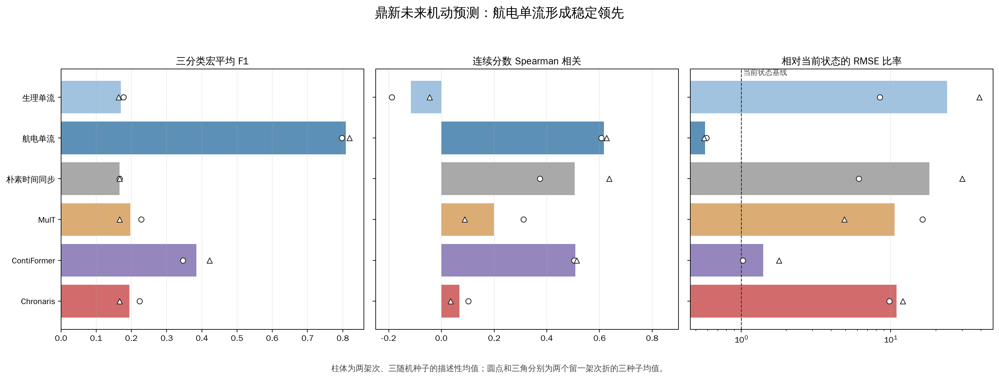
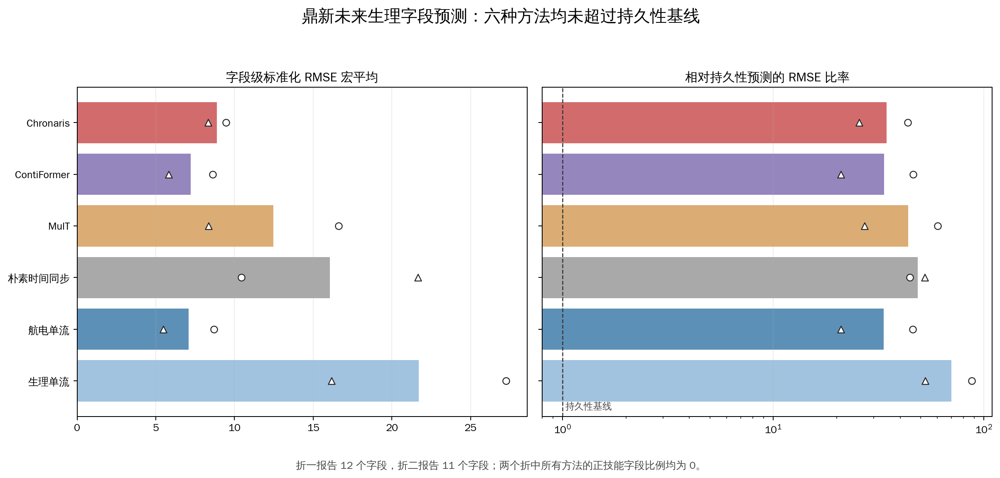
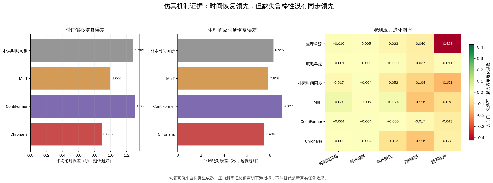
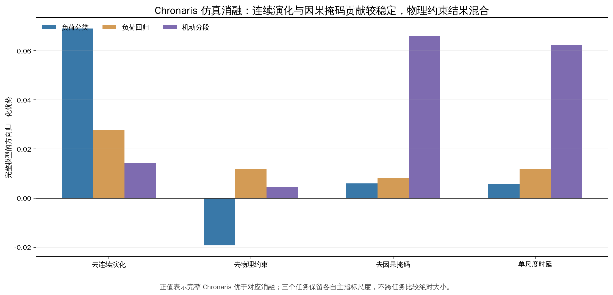

# Chronaris 鼎新未来下游评价复核报告

## 技术摘要

**协议冻结后的确认评价没有支持 Chronaris 在鼎新真实未来任务上的整体优势。**六种方法在相同 64 维冻结表示出口、相同逻辑回归与岭回归下完成两个留一架次折和三个随机种子，共 36 个方法—折—随机种子单元。未来机动任务由航电单流领先；未来生理字段任务中，六种方法在两个折上的正技能字段比例均为 0，均未超过“保持当前状态不变”的持久性基线。

**现有仿真证据仍支持有限的时间机制结论。**Chronaris 在时钟偏移和生理响应时延恢复上取得最低误差，连续演化与因果掩码消融也显示局部贡献；但随机缺失和连续缺失的退化斜率处于不利位置，物理约束贡献呈混合结果。因此论文可保留“时间机制可恢复、部分组件有效”的论断，不能据此替代真实下游优势。

**研究执行应在此停止结果驱动调参，转入如实写作。**本轮正式结果已经打开；继续针对这两个架次调模型只会提高测试集适配风险。论文主结论宜写为“局部有效、分项领先、整体优势尚未成立”，并明确真实未来任务尚未形成 Chronaris 优势。

## 航电历史足以完成未来机动预测，融合表示没有带来增益

航电单流的机动强度三分类宏平均 F1 为 **0.808**，连续分数 Spearman 相关为 **0.617**，相对当前机动状态的技能为 **0.668**。Chronaris 对应值为 **0.195**、**0.069** 和 **-123.586**。ContiFormer 虽在融合方法中较强，但三分类宏平均 F1 也只有 **0.384**。

图中柱体给出两折、三随机种子的描述性均值，两个标记点保留两架次的折级差异。相对当前状态的 RMSE 比率以 1 为基准，低于 1 才表示优于直接延续当前机动状态；只有航电单流形成稳定正技能。该结果说明未来 5 秒机动主要由过去 30 秒航电运动历史解释，当前人机融合表示没有增加可用预测信息。

## 生理字段预测没有越过持久性基线

字段级标准化 RMSE 宏平均的最佳方法仍是航电单流（**7.084**），ContiFormer 为 **7.227**，Chronaris 为 **8.890**。更关键的是，所有方法的相对持久性 RMSE 比率都远高于 1，且两个折中每种方法的正技能字段比例均为 0。

持久性基线直接使用输入末段的当前生理状态预测未来 5 秒。模型没有超过这一基线，说明现有样本量和字段稳定性不足以证明航电背景对短期生理变化提供了额外可预测信息。该任务可以作为严格的负面结果保留，但不能再用旧模型相对自身的误差下降宣称生理预测有效。

## 仿真只支持时间机制的局部有效性

Chronaris 的时钟偏移恢复平均绝对误差为 **0.888 秒**，生理响应时延恢复误差为 **7.486 秒**，均为四种融合方法中的最低值；与此同时，其随机缺失和连续缺失方向归一化斜率分别为 **-0.073** 和 **-0.126**，没有形成鲁棒性领先。

这组图回答的是“融合表示是否保留仿真生成器中的时间机制”，不是“鼎新真实任务是否更好”。它支持 Chronaris 对相对时钟偏移和响应时延的表达能力，但同时要求保留缺失压力下的不利结果。

消融结果显示，连续演化在三个仿真任务上均带来正向贡献，因果掩码对机动分段的贡献较明显；物理约束在负荷分类上为负、在回归与分段上为正。因此，组件解释应使用“分任务贡献”，不写成每个组件在所有任务上都稳定增益。

## 评价范围、数据与指标定义

- 数据范围为两个飞行架次、三个飞行员视图和 111 个基础窗口；构造后保留 90 个完整未来视图上下文，其中未来机动只有 60 个独立飞机上下文。
- 输入区间为预测时刻前 30 秒，目标区间为随后 5 秒。输入结束时间严格等于目标开始时间，目标窗口完整落在冻结快照内。
- 主要划分为留一架次：每折完全留出一个飞行架次。两个折均有 30 个独立机动上下文，低、中、高类别各 10 个。
- 未来机动主结果包括连续分数 Spearman 相关、按训练折四分位距归一化的 MAE、相对当前机动状态技能；低、中、高三分类宏平均 F1 作为导师要求的直接对应任务。
- 未来生理状态按字段预测未来 5 秒中位数，字段只用训练架次中位数和四分位距标准化；主结果为字段级标准化 RMSE、MAE 和相对持久性技能。

## 冻结表示与固定下游算法保证了比较口径一致

五种可训练编码器在任务目标和留出架次关闭的条件下完成任务无关预训练，朴素时间同步在训练折拟合；六种方法均导出 64 维窗口表示。下游分类统一使用 `C=1.0` 的逻辑回归，连续任务统一使用 `alpha=1.0` 的岭回归。正式结果打开前配置已经冻结，打开后未根据分数更换任务、字段、模型或下游算法。

## 计算链路正确，但结论只能作描述性确认

正式结果包含 36 个完整评价单元和 504 条有限指标。报告生成阶段重新校验了 108 个逐样本文件哈希，并从逐样本预测独立复算 504 个核心单元指标；与已发布汇总的最大绝对差均处于浮点舍入范围。两个折的类别支持、90/60 上下文计数和未来时间边界也全部复核通过。

本评价仍有三项重要限制。第一，只有两个架次，不能进行有意义的显著性推断；图表中的折级点用于展示异质性，不是置信区间。第二，这批数据已在前期工作中多次查看，因此本轮是“协议冻结后的分组确认”，不是从未打开的盲测。第三，未来生理字段在两个折中分别有 12 和 11 个满足训练尺度条件的字段，跨架次分布变化较大，持久性基线远强于学习模型。

## 建议停止调参并按混合证据撰写论文

1. 把鼎新未来机动与未来生理任务作为真实数据主表，并如实报告航电单流领先、所有生理模型未超过持久性。
2. 把仿真时间恢复、压力退化和机制消融作为独立机制证据，完整保留缺失压力和物理约束的负面结果。
3. 不再根据这两个架次的正式结果修改 Chronaris；不重跑端到端训练、教师蒸馏或仿真迁移。
4. 论文结论使用“时间机制局部有效，但真实下游整体优势尚未成立”，避免将仿真机制证据写成鼎新应用效果。

## 仍待回答的问题

- 若未来能获得更多独立架次，航电单流优势是否仍然稳定，生理响应是否能出现超过持久性的可预测变化？
- Chronaris 在缺失压力下的退化是否来自连续演化、输入掩码处理还是预训练目标？该问题不在本轮论文主线继续扩展。
- 留一视图只能诊断同一飞行轨迹下的飞行员视图适配，不能改变本轮跨架次主结论；为避免结果打开后的范围扩张，本轮不新增该诊断训练线。
