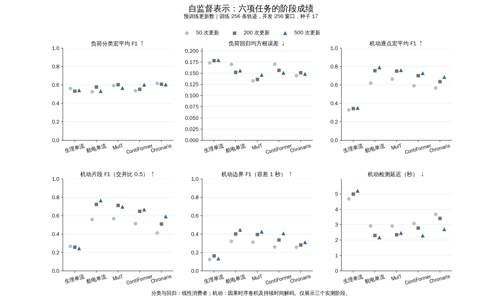
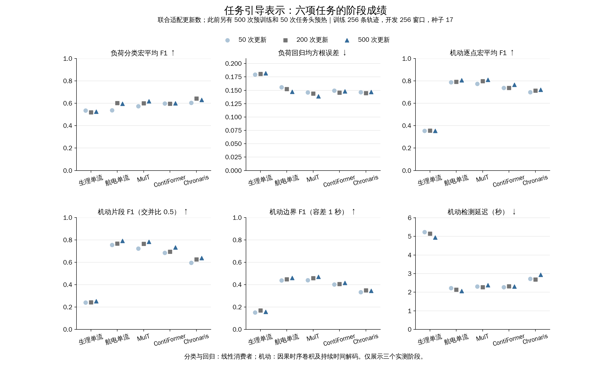
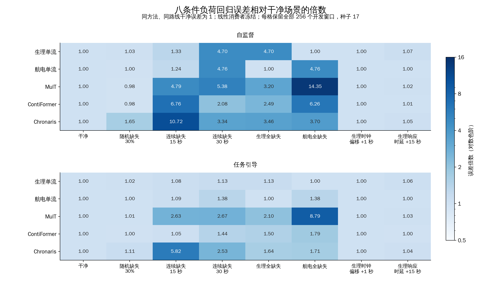
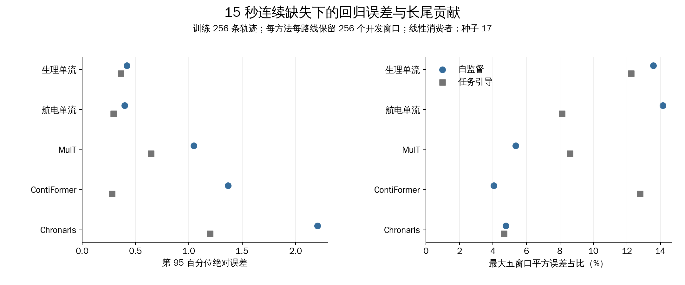
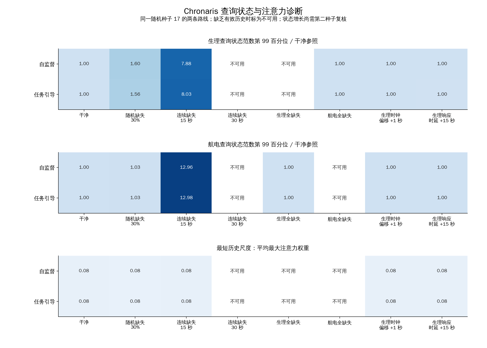
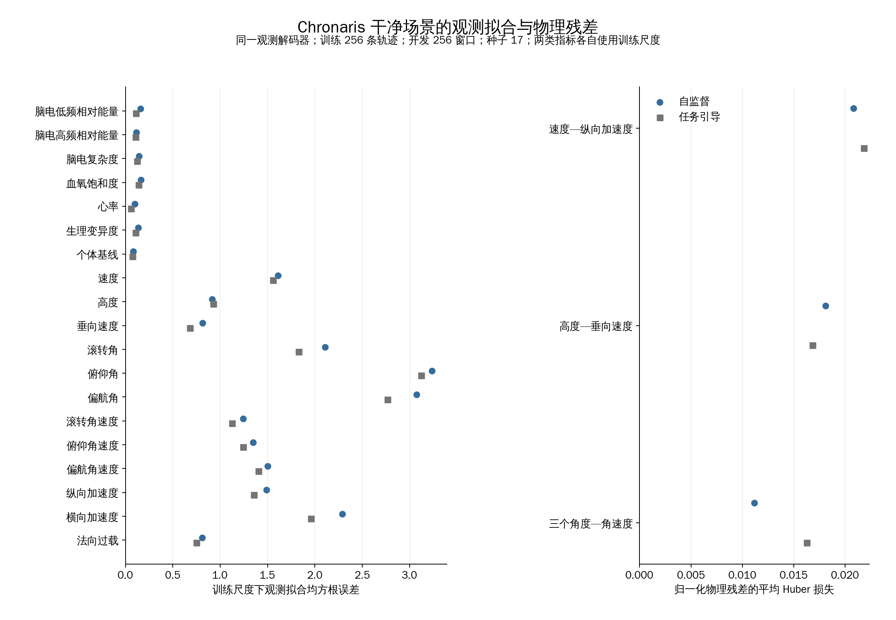
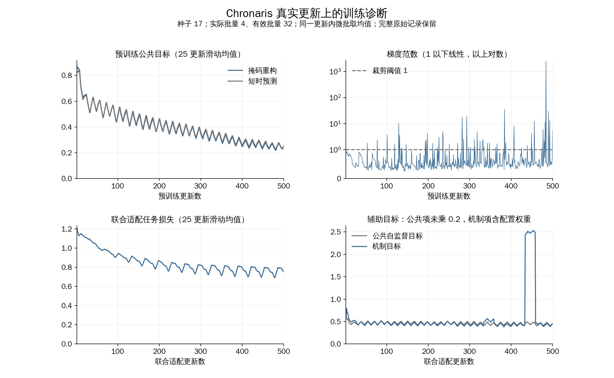

# 初始训练与压力诊断图表

初始诊断支持继续改善连续缺失下的状态演化与航电观测拟合。七张中文图覆盖两条路线的六项阶段成绩、八条件回归退化、误差长尾、状态与注意力、观测和物理残差，以及真实更新上的训练损失与梯度；全部来自已完成的 256 条训练轨迹、64 条开发轨迹和种子 17。

图中的 MulT 为多模态变换器，ContiFormer 为连续时间变换器，Chronaris 为本研究连续对齐与语义融合模型。宏平均 F1 为分类综合指标，均方根误差越低越好；机动成绩使用因果时序卷积和持续时间解码。阶段点只表示实际评价位置，不插补中间成绩。

## 阶段成绩

自监督机动成绩随预训练推进整体提高，但负荷分类与回归并未同步单调改善。下图展示五方法在 50、200、500 次真实预训练更新后的六项任务成绩，每次重新拟合相同消费者。



任务引导的变化依赖具体任务与方法。Chronaris 在第 500 次联合更新的负荷分类宏平均 F1 为 0.6307，机动逐点宏平均 F1 为 0.7214；MulT 对应机动逐点成绩为 0.8108。下图明确标出此前另有 500 次预训练和 50 次任务头预热，不能把联合更新数当作整条路线的总计算量。



## 压力与长尾

连续缺失对不同结构的影响明显不同。下图每格以本方法、本路线的干净均方根误差为分母，保留全部 256 个开发窗口；15 秒缺失时 Chronaris 的误差分别增至 10.72 倍和 5.82 倍。时钟偏移及生理响应时延是独立输入条件，图中任务误差不代表相应时延恢复误差。



15 秒缺失下的 Chronaris 回归退化分布较广。最大五个窗口只贡献约 4.78% 和 4.66% 的平方误差；下图同时展示第 95 百分位绝对误差，避免用少数异常窗口解释整个退化。所有样本均纳入分母，窗口身份保留在原始误差分解中。



## 表示与训练诊断

状态统计提供了需要第二种子复核的增长信号。15 秒缺失时，Chronaris 航电查询状态范数第 99 百分位分别为干净参照的 12.96 和 12.98 倍；两条路线属于同一随机种子。无有效历史的条件显示为不可用。最短历史尺度平均最大注意力权重约为 0.08，仅作为注意力分布描述，不据此推断独立配对或精确时延恢复成立。



逐字段结果定位到航电观测拟合仍有改善空间。下图左侧保留全部 19 个字段的训练尺度下拟合误差，部分角度字段超过 3；右侧是同一解码器输出的归一化物理残差，使用 Huber 稳健损失。较小的约束残差需要结合观测拟合共同评价，后续继续保持观测锚定。



训练目标下降伴随少数显著梯度尖峰。500 次预训练更新中，裁剪前梯度范数中位数为 0.488，第 95 百分位为 2.212；54 次超过阈值 1，最大值 2529.628 出现在第 484 次更新。下图保留逐更新梯度，损失采用标明的 25 更新滑动均值，原始逐更新数值仍可查阅。联合适配机制目标也出现阶段性尖峰，后续候选继续记录这些诊断，不据此增加未规定的搜索。



## 来源与复现

本批核验 243 个来源文件，其中包含 50 个训练检查点及 80 个压力单元的结果、预测文件。阶段图的 180 个值与原始消费者结果逐项比对；压力每个单元保留 256 个窗口。图、来源文件哈希和范围见[图表清单](figure_manifest.json)，阶段数值见 [stage_values.csv](stage_values.csv)，损失与梯度见 [training_values.csv](training_values.csv)，压力分解见 [pressure_values.json](pressure_values.json)。每张 PNG 均有同名 SVG 矢量版本。

使用仓库环境在根目录重绘：

```bash
CUDA_VISIBLE_DEVICES='' OMP_NUM_THREADS=1 MKL_NUM_THREADS=1 OPENBLAS_NUM_THREADS=1 \
/home/wangminan/env/anaconda3/envs/chronaris/bin/python \
scripts/evaluation/application_tasks/run_thesis_v4.py diagnostic-figures \
--domain simulation --output-root docs/artifacts/runs/2026-09-08_v4-diagnostic-figures
```

本包属于初始开发诊断；扩展到 512 条训练轨迹后的候选仍单独评价，正式确认、三种子选型和核心消融继续按原计划推进。原始诊断和压力文件未改写，旧任务引导压力表示的标签标记问题沿用[来源修复说明](../../../review/stage/thesis-v4/confirmation-contracts-20260908/README.md)。
