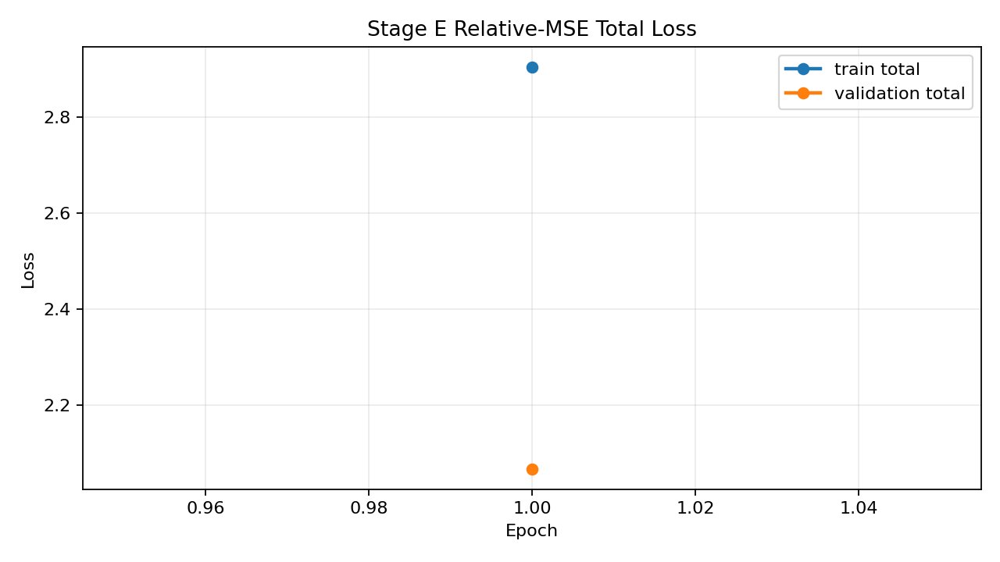
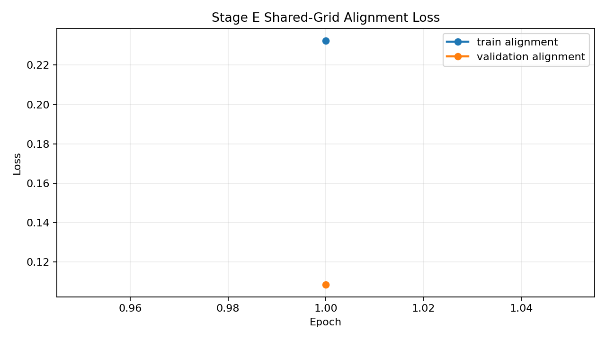
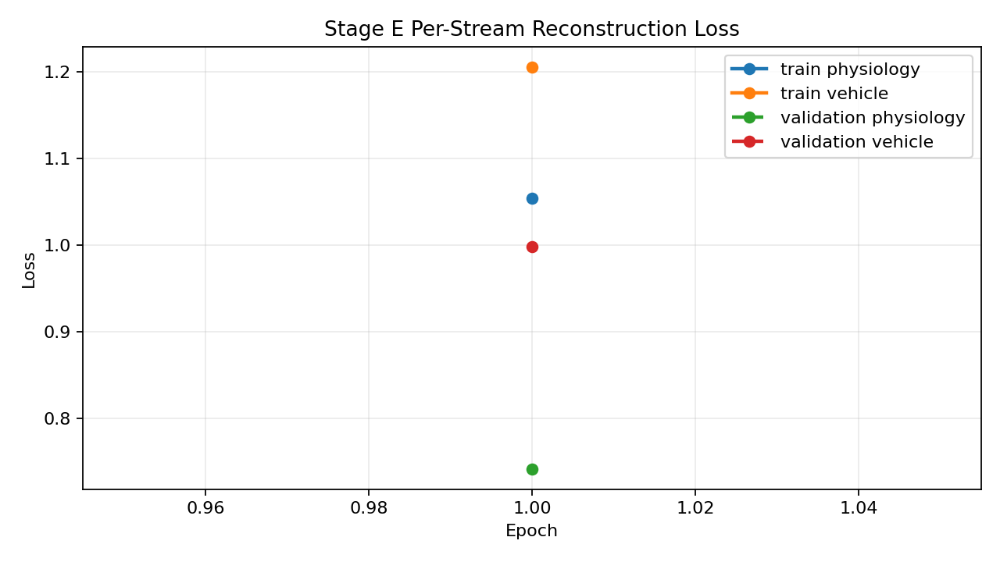
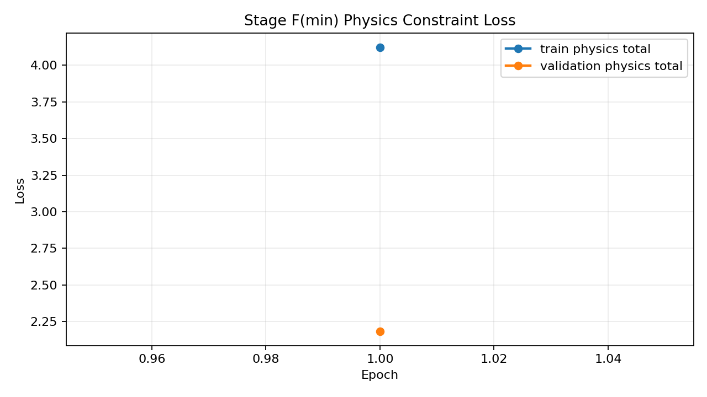
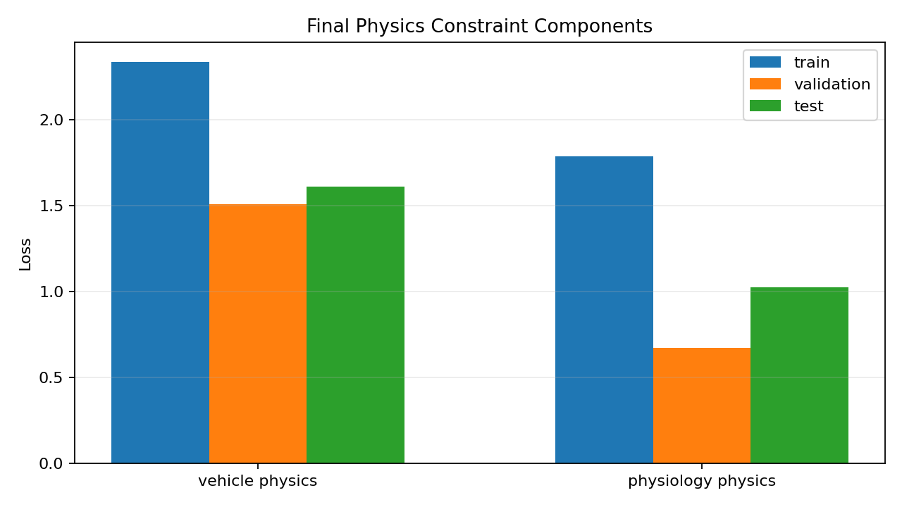
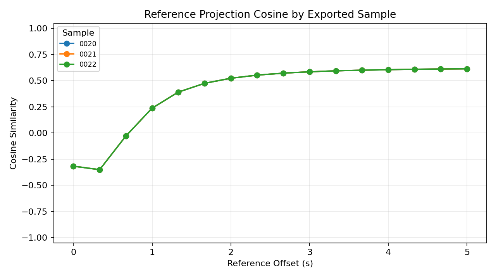

# Alignment Preview - 20251005_四01_ACT-4_云_J20_22#01

## Sample Summary

- sample count: `25`
- max physiology feature count: `12`
- max vehicle feature count: `21`

## Split Summary

- train: `15`
- validation: `5`
- test: `5`
- skipped between train/validation: `0`
- skipped between validation/test: `0`

## Final Train Metrics

- physiology reconstruction: `1.053999`
- vehicle reconstruction: `1.206278`
- reconstruction total: `2.260277`
- alignment: `0.232481`
- vehicle physics: `2.336458`
- physiology physics: `1.786833`
- physics total: `4.123291`
- total: `2.905087`

## Final Validation Metrics

- physiology reconstruction: `0.741492`
- vehicle reconstruction: `0.998567`
- reconstruction total: `1.740059`
- alignment: `0.108486`
- vehicle physics: `1.510836`
- physiology physics: `0.672383`
- physics total: `2.183219`
- total: `2.066867`

## Reference Intermediate Export

- partition: `test`
- exported sample count: `3`
- reference point count: `16`
- exported sample ids: `20251005_四01_ACT-4_云_J20_22#01:0020, 20251005_四01_ACT-4_云_J20_22#01:0021, 20251005_四01_ACT-4_云_J20_22#01:0022`
- physiology mean reference projection L2: `1.173177`
- vehicle mean reference projection L2: `1.143231`
- mean cross-stream projection cosine: `0.392279`

## Test Metrics

- physiology reconstruction: `0.769206`
- vehicle reconstruction: `0.992025`
- reconstruction total: `1.761231`
- alignment: `0.108486`
- vehicle physics: `1.611761`
- physiology physics: `1.025665`
- physics total: `2.637427`
- total: `2.133460`

## Physics Constraint Diagnostics

- enabled: `True`
- family: `full`
- mode: `feature_first_with_latent_fallback`
- vehicle metadata status: `loaded`
- vehicle metadata fields: `96`

| metric | train | validation | test |
| --- | ---: | ---: | ---: |
| vehicle physics | 2.336458 | 1.510836 | 1.611761 |
| physiology physics | 1.786833 | 0.672383 | 1.025665 |
| physics total | 4.123291 | 2.183219 | 2.637427 |

### Component Breakdown

| component | train | validation | test |
| --- | ---: | ---: | ---: |
| physiology_envelope | 0.000000 | 0.000000 | 0.000000 |
| physiology_latent | 0.812019 | 0.197363 | 0.197363 |
| physiology_pairwise | 0.071244 | 0.057832 | 0.071860 |
| physiology_smoothness | 0.903570 | 0.417188 | 0.756442 |
| physiology_spo2_delta | 0.000000 | 0.000000 | 0.000000 |
| vehicle_envelope | 0.000000 | 0.000000 | 0.000000 |
| vehicle_latent | 0.203640 | 0.106621 | 0.106621 |
| vehicle_rigid_body_rotation | 0.000000 | 0.000000 | 0.000000 |
| vehicle_rigid_body_translation | 0.000000 | 0.000000 | 0.000000 |
| vehicle_rigid_body_vertical | 0.000000 | 0.000000 | 0.000000 |
| vehicle_semantic | 1.598933 | 1.362209 | 1.444417 |
| vehicle_smoothness | 0.533885 | 0.042006 | 0.060723 |

## Sample-Level Projection Diagnostics

- sample count: `3`
- reference point count: `16`
- mean projection cosine: `0.392279`
- min projection cosine: `-0.350352`
- max projection cosine: `0.613787`
- mean projection L2 gap: `0.061477`
- mean projection L2 ratio (vehicle/physiology): `0.973587`
- std projection cosine (cross-sample): `0.000000`
- cv projection cosine (cross-sample): `0.000000`
- std projection L2 gap (cross-sample): `0.000000`
- cv projection L2 gap (cross-sample): `0.000000`
- std projection L2 ratio (cross-sample): `0.000000`
- cv projection L2 ratio (cross-sample): `0.000000`

### Threshold Evaluation

- verdict: `WARN`

| check | actual | operator | expected | result |
| --- | ---: | :---: | ---: | :---: |
| sample_count | 3.000000 | >= | 1.000000 | PASS |
| mean_projection_cosine | 0.392279 | >= | 0.650000 | WARN |
| mean_projection_l2_gap | 0.061477 | <= | 0.250000 | PASS |
| mean_projection_l2_ratio_deviation | 0.026413 | <= | 0.300000 | PASS |
| projection_cosine_cv | 0.000000 | <= | 0.150000 | PASS |
| projection_l2_gap_cv | 0.000000 | <= | 0.250000 | PASS |

| sample id | mean cosine | min cosine | max cosine | mean L2 gap | mean L2 ratio |
| --- | ---: | ---: | ---: | ---: | ---: |
| 20251005_四01_ACT-4_云_J20_22#01:0020 | 0.392279 | -0.350352 | 0.613787 | 0.061477 | 0.973587 |
| 20251005_四01_ACT-4_云_J20_22#01:0021 | 0.392279 | -0.350352 | 0.613787 | 0.061477 | 0.973587 |
| 20251005_四01_ACT-4_云_J20_22#01:0022 | 0.392279 | -0.350352 | 0.613787 | 0.061477 | 0.973587 |

## Visual Artifacts

### Train/Validation Total Loss

### Train/Validation Alignment Loss

### Per-Stream Reconstruction Loss

### Train/Validation Physics Loss

### Final Physics Constraint Components

### Reference Projection Cosine

