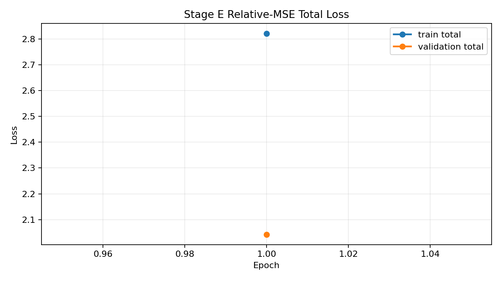
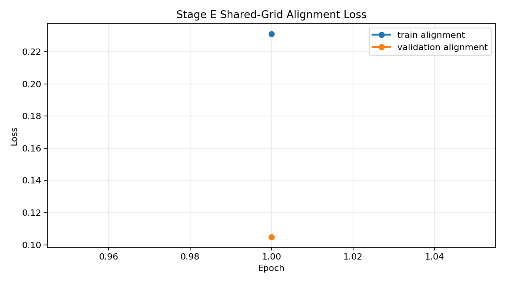
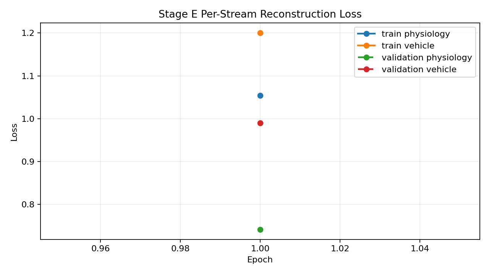
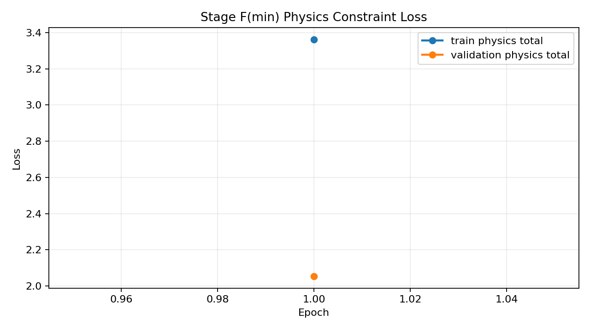
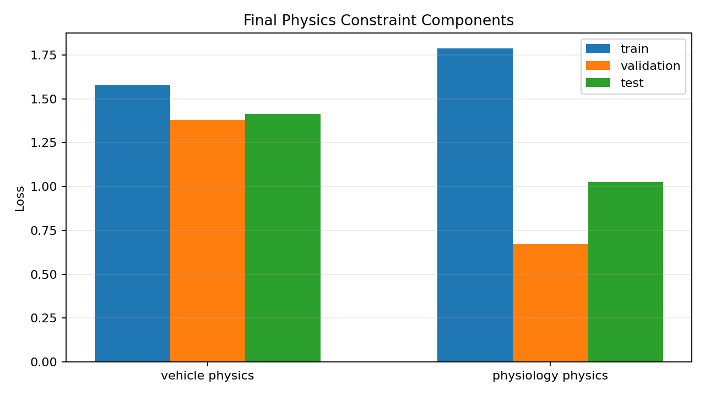
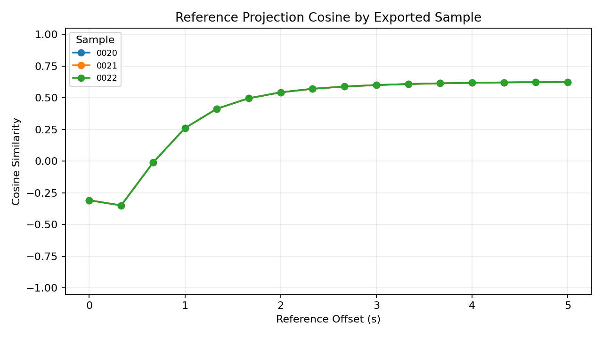

# Alignment Preview - 20251005_四01_ACT-4_云_J20_22#01

## Sample Summary

- sample count: `25`
- max physiology feature count: `12`
- max vehicle feature count: `21`

## Split Summary

- train: `15`
- validation: `5`
- test: `5`
- skipped between train/validation: `0`
- skipped between validation/test: `0`

## Final Train Metrics

- physiology reconstruction: `1.053999`
- vehicle reconstruction: `1.200810`
- reconstruction total: `2.254809`
- alignment: `0.231171`
- vehicle physics: `1.576173`
- physiology physics: `1.786833`
- physics total: `3.363006`
- total: `2.822280`

## Final Validation Metrics

- physiology reconstruction: `0.741461`
- vehicle reconstruction: `0.990172`
- reconstruction total: `1.731633`
- alignment: `0.104823`
- vehicle physics: `1.381446`
- physiology physics: `0.672065`
- physics total: `2.053511`
- total: `2.041807`

## Reference Intermediate Export

- partition: `test`
- exported sample count: `3`
- reference point count: `16`
- exported sample ids: `20251005_四01_ACT-4_云_J20_22#01:0020, 20251005_四01_ACT-4_云_J20_22#01:0021, 20251005_四01_ACT-4_云_J20_22#01:0022`
- physiology mean reference projection L2: `1.174579`
- vehicle mean reference projection L2: `1.124309`
- mean cross-stream projection cosine: `0.406982`

## Test Metrics

- physiology reconstruction: `0.769177`
- vehicle reconstruction: `0.988216`
- reconstruction total: `1.757392`
- alignment: `0.104823`
- vehicle physics: `1.413177`
- physiology physics: `1.025200`
- physics total: `2.438377`
- total: `2.106053`

## Physics Constraint Diagnostics

- enabled: `True`
- family: `rigid_body`
- mode: `feature_first_with_latent_fallback`
- vehicle metadata status: `loaded`
- vehicle metadata fields: `96`

| metric | train | validation | test |
| --- | ---: | ---: | ---: |
| vehicle physics | 1.576173 | 1.381446 | 1.413177 |
| physiology physics | 1.786833 | 0.672065 | 1.025200 |
| physics total | 3.363006 | 2.053511 | 2.438377 |

### Component Breakdown

| component | train | validation | test |
| --- | ---: | ---: | ---: |
| physiology_envelope | 0.000000 | 0.000000 | 0.000000 |
| physiology_latent | 0.812019 | 0.197105 | 0.197105 |
| physiology_pairwise | 0.071244 | 0.057831 | 0.071857 |
| physiology_smoothness | 0.903570 | 0.417129 | 0.756237 |
| physiology_spo2_delta | 0.000000 | 0.000000 | 0.000000 |
| vehicle_envelope | 0.000000 | 0.000000 | 0.000000 |
| vehicle_latent | 0.000000 | 0.000000 | 0.000000 |
| vehicle_rigid_body_rotation | 0.000000 | 0.000000 | 0.000000 |
| vehicle_rigid_body_translation | 1.576173 | 1.381446 | 1.413177 |
| vehicle_rigid_body_vertical | 0.000000 | 0.000000 | 0.000000 |
| vehicle_semantic | 0.000000 | 0.000000 | 0.000000 |
| vehicle_smoothness | 0.000000 | 0.000000 | 0.000000 |

## Sample-Level Projection Diagnostics

- sample count: `3`
- reference point count: `16`
- mean projection cosine: `0.406982`
- min projection cosine: `-0.349276`
- max projection cosine: `0.624796`
- mean projection L2 gap: `0.073588`
- mean projection L2 ratio (vehicle/physiology): `0.956252`
- std projection cosine (cross-sample): `0.000000`
- cv projection cosine (cross-sample): `0.000000`
- std projection L2 gap (cross-sample): `0.000000`
- cv projection L2 gap (cross-sample): `0.000000`
- std projection L2 ratio (cross-sample): `0.000000`
- cv projection L2 ratio (cross-sample): `0.000000`

### Threshold Evaluation

- verdict: `WARN`

| check | actual | operator | expected | result |
| --- | ---: | :---: | ---: | :---: |
| sample_count | 3.000000 | >= | 1.000000 | PASS |
| mean_projection_cosine | 0.406982 | >= | 0.650000 | WARN |
| mean_projection_l2_gap | 0.073588 | <= | 0.250000 | PASS |
| mean_projection_l2_ratio_deviation | 0.043748 | <= | 0.300000 | PASS |
| projection_cosine_cv | 0.000000 | <= | 0.150000 | PASS |
| projection_l2_gap_cv | 0.000000 | <= | 0.250000 | PASS |

| sample id | mean cosine | min cosine | max cosine | mean L2 gap | mean L2 ratio |
| --- | ---: | ---: | ---: | ---: | ---: |
| 20251005_四01_ACT-4_云_J20_22#01:0020 | 0.406982 | -0.349276 | 0.624796 | 0.073588 | 0.956252 |
| 20251005_四01_ACT-4_云_J20_22#01:0021 | 0.406982 | -0.349276 | 0.624796 | 0.073588 | 0.956252 |
| 20251005_四01_ACT-4_云_J20_22#01:0022 | 0.406982 | -0.349276 | 0.624796 | 0.073588 | 0.956252 |

## Visual Artifacts

### Train/Validation Total Loss

### Train/Validation Alignment Loss

### Per-Stream Reconstruction Loss

### Train/Validation Physics Loss

### Final Physics Constraint Components

### Reference Projection Cosine

