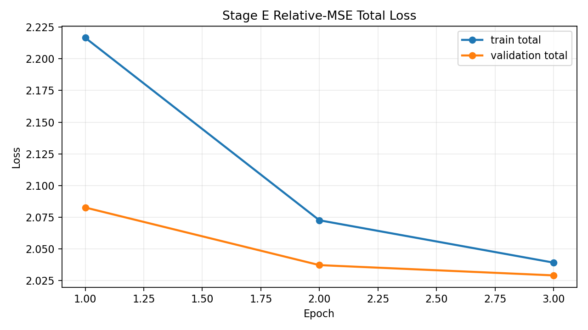
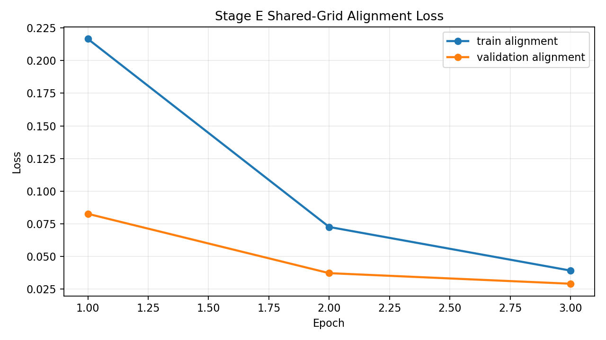
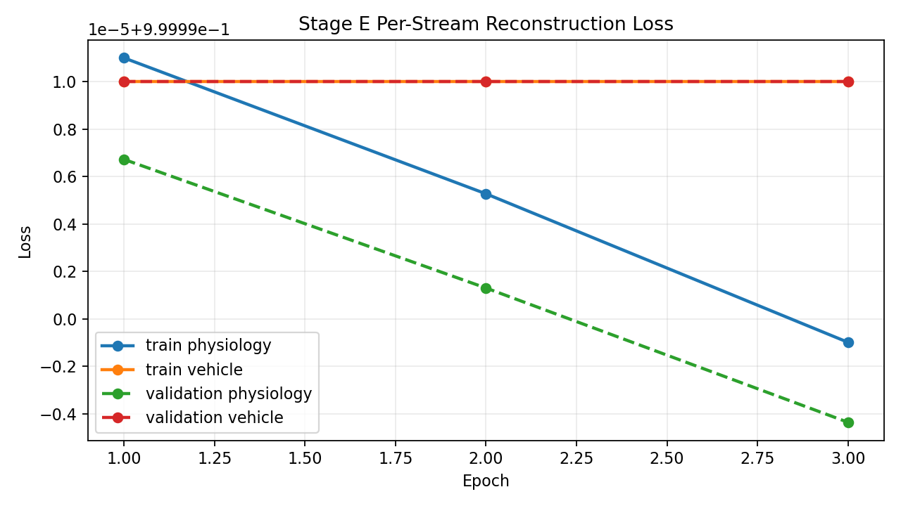
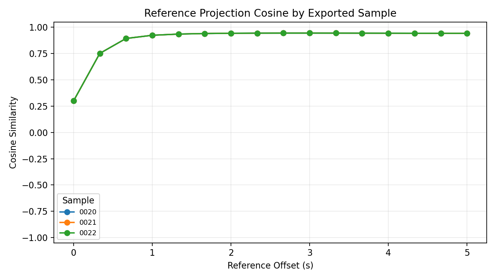

# Alignment Preview - 20251005_四01_ACT-4_云_J20_22#01

## Sample Summary

- sample count: `25`
- max physiology feature count: `12`
- max vehicle feature count: `21`

## Split Summary

- train: `15`
- validation: `5`
- test: `5`
- skipped between train/validation: `0`
- skipped between validation/test: `0`

## Final Train Metrics

- physiology reconstruction: `0.999989`
- vehicle reconstruction: `1.000000`
- reconstruction total: `1.999989`
- alignment: `0.039260`
- total: `2.039249`

## Final Validation Metrics

- physiology reconstruction: `0.999986`
- vehicle reconstruction: `1.000000`
- reconstruction total: `1.999986`
- alignment: `0.029199`
- total: `2.029185`

## Reference Intermediate Export

- partition: `test`
- exported sample count: `3`
- reference point count: `16`
- exported sample ids: `20251005_四01_ACT-4_云_J20_22#01:0020, 20251005_四01_ACT-4_云_J20_22#01:0021, 20251005_四01_ACT-4_云_J20_22#01:0022`
- physiology mean reference projection L2: `1.311456`
- vehicle mean reference projection L2: `1.338019`
- mean cross-stream projection cosine: `0.885391`

## Test Metrics

- physiology reconstruction: `0.999986`
- vehicle reconstruction: `1.000000`
- reconstruction total: `1.999986`
- alignment: `0.029199`
- total: `2.029186`

## Sample-Level Projection Diagnostics

- sample count: `3`
- reference point count: `16`
- mean projection cosine: `0.885391`
- min projection cosine: `0.299042`
- max projection cosine: `0.943641`
- mean projection L2 gap: `0.038909`
- mean projection L2 ratio (vehicle/physiology): `1.020916`

| sample id | mean cosine | min cosine | max cosine | mean L2 gap | mean L2 ratio |
| --- | ---: | ---: | ---: | ---: | ---: |
| 20251005_四01_ACT-4_云_J20_22#01:0020 | 0.885391 | 0.299042 | 0.943641 | 0.038909 | 1.020916 |
| 20251005_四01_ACT-4_云_J20_22#01:0021 | 0.885391 | 0.299042 | 0.943641 | 0.038909 | 1.020916 |
| 20251005_四01_ACT-4_云_J20_22#01:0022 | 0.885391 | 0.299042 | 0.943641 | 0.038909 | 1.020916 |

## Visual Artifacts

### Train/Validation Total Loss

### Train/Validation Alignment Loss

### Per-Stream Reconstruction Loss

### Reference Projection Cosine

