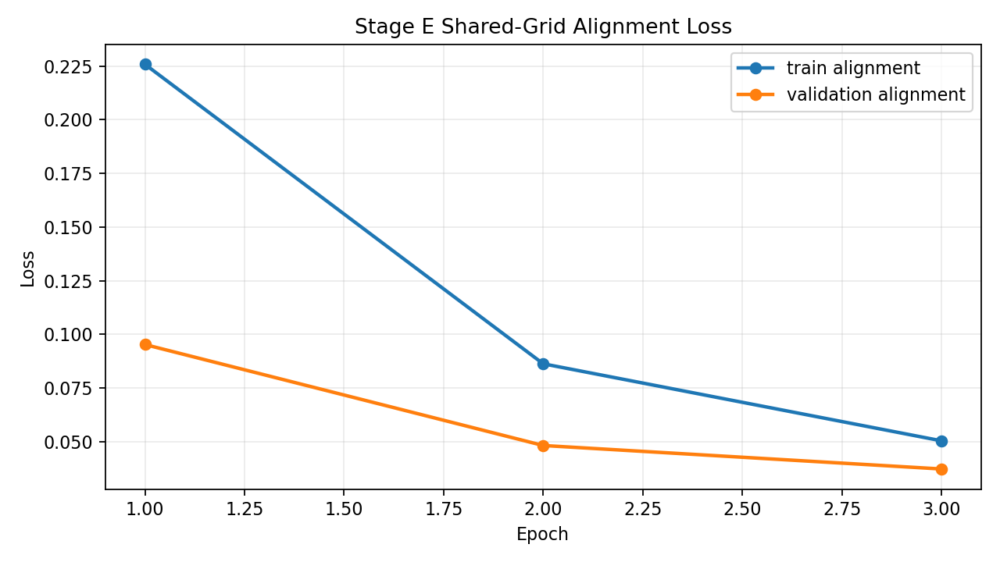
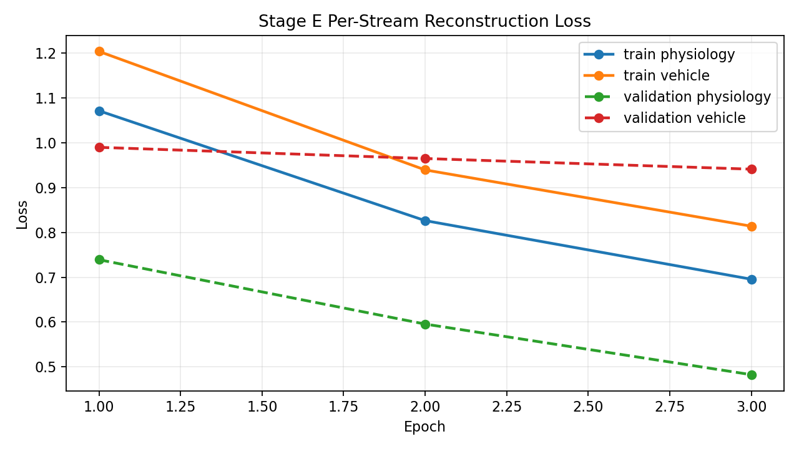
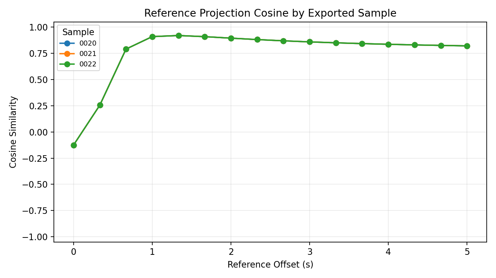

# Alignment Preview - 20251005_四01_ACT-4_云_J20_22#01

## Sample Summary

- sample count: `25`
- max physiology feature count: `12`
- max vehicle feature count: `21`

## Split Summary

- train: `15`
- validation: `5`
- test: `5`
- skipped between train/validation: `0`
- skipped between validation/test: `0`

## Final Train Metrics

- physiology reconstruction: `0.695477`
- vehicle reconstruction: `0.813646`
- reconstruction total: `1.509124`
- alignment: `0.050399`
- total: `1.559523`

## Final Validation Metrics

- physiology reconstruction: `0.482749`
- vehicle reconstruction: `0.940772`
- reconstruction total: `1.423521`
- alignment: `0.037269`
- total: `1.460789`

## Reference Intermediate Export

- partition: `test`
- exported sample count: `3`
- reference point count: `16`
- exported sample ids: `20251005_四01_ACT-4_云_J20_22#01:0020, 20251005_四01_ACT-4_云_J20_22#01:0021, 20251005_四01_ACT-4_云_J20_22#01:0022`
- physiology mean reference projection L2: `1.158962`
- vehicle mean reference projection L2: `0.979482`
- mean cross-stream projection cosine: `0.760173`

## Test Metrics

- physiology reconstruction: `0.559753`
- vehicle reconstruction: `0.964445`
- reconstruction total: `1.524198`
- alignment: `0.037269`
- total: `1.561467`

## Sample-Level Projection Diagnostics

- sample count: `3`
- reference point count: `16`
- mean projection cosine: `0.760173`
- min projection cosine: `-0.125378`
- max projection cosine: `0.919423`
- mean projection L2 gap: `0.211933`
- mean projection L2 ratio (vehicle/physiology): `0.852181`
- std projection cosine (cross-sample): `0.000000`
- cv projection cosine (cross-sample): `0.000000`
- std projection L2 gap (cross-sample): `0.000000`
- cv projection L2 gap (cross-sample): `0.000000`
- std projection L2 ratio (cross-sample): `0.000000`
- cv projection L2 ratio (cross-sample): `0.000000`

### Threshold Evaluation

- verdict: `PASS`

| check | actual | operator | expected | result |
| --- | ---: | :---: | ---: | :---: |
| sample_count | 3.000000 | >= | 1.000000 | PASS |
| mean_projection_cosine | 0.760173 | >= | 0.650000 | PASS |
| mean_projection_l2_gap | 0.211933 | <= | 0.250000 | PASS |
| mean_projection_l2_ratio_deviation | 0.147819 | <= | 0.300000 | PASS |
| projection_cosine_cv | 0.000000 | <= | 0.150000 | PASS |
| projection_l2_gap_cv | 0.000000 | <= | 0.250000 | PASS |

| sample id | mean cosine | min cosine | max cosine | mean L2 gap | mean L2 ratio |
| --- | ---: | ---: | ---: | ---: | ---: |
| 20251005_四01_ACT-4_云_J20_22#01:0020 | 0.760173 | -0.125378 | 0.919423 | 0.211933 | 0.852181 |
| 20251005_四01_ACT-4_云_J20_22#01:0021 | 0.760173 | -0.125378 | 0.919423 | 0.211933 | 0.852181 |
| 20251005_四01_ACT-4_云_J20_22#01:0022 | 0.760173 | -0.125378 | 0.919423 | 0.211933 | 0.852181 |

## Visual Artifacts

### Train/Validation Total Loss

### Train/Validation Alignment Loss

### Per-Stream Reconstruction Loss

### Reference Projection Cosine

