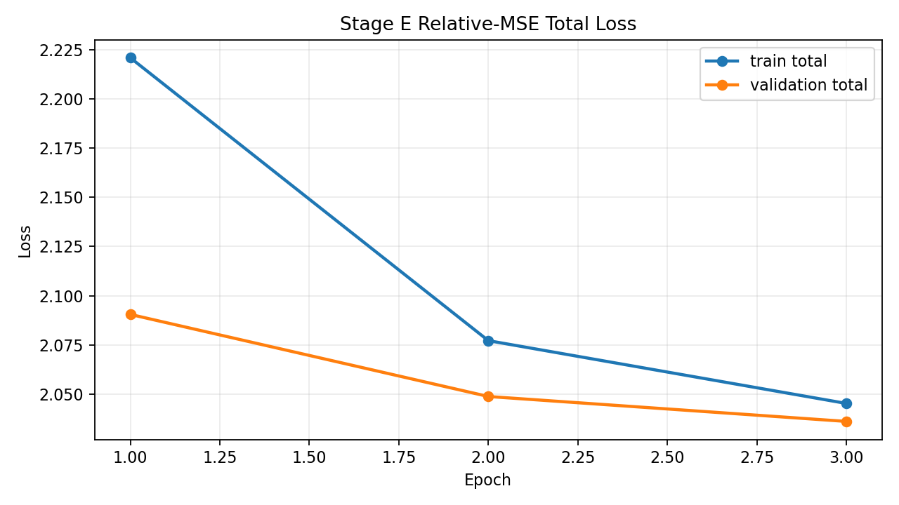
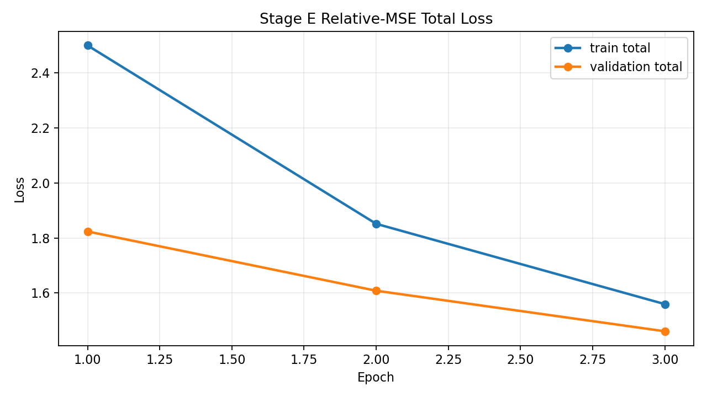

# Stage E Normalization Comparison

- primary mode: `none`
- secondary mode: `zscore_train`
- sample count: `25`
- split: train `15`, validation `5`, test `5`

| metric | primary | secondary |
| --- | ---: | ---: |
| final train total | 2.045169 | 1.559523 |
| final validation total | 2.036023 | 1.460789 |
| test total | 2.036023 | 1.561467 |
| threshold verdict | PASS | PASS |

## Diagnostics Summary

| metric | primary | secondary |
| --- | ---: | ---: |
| mean projection cosine | 0.764829 | 0.760173 |
| min projection cosine | -0.138953 | -0.125378 |
| mean projection L2 gap | 0.188564 | 0.211933 |
| mean projection L2 ratio | 0.865656 | 0.852181 |

## Decision

- both threshold templates are `PASS` / `PASS` under the default Stage E closure rules
- recommended mode for Stage F entry: `zscore_train` (lower test total `1.561467` vs `2.036023`)

## Visual Artifacts

### Primary `none` - Total Loss

### Secondary `zscore_train` - Total Loss

## Diagnostic Artifacts

- primary summary json: `/home/wangminan/projects/chronaris/docs/reports/assets/alignment-preview-stage-e-closure-2026-04-21-none/projection_diagnostics_summary.json`
- secondary summary json: `/home/wangminan/projects/chronaris/docs/reports/assets/alignment-preview-stage-e-closure-2026-04-21-zscore_train/projection_diagnostics_summary.json`

## Checkpoints

- primary checkpoint: `/home/wangminan/projects/chronaris/docs/reports/assets/alignment-preview-stage-e-closure-2026-04-21-none/alignment_model_checkpoint.pt`
- secondary checkpoint: `/home/wangminan/projects/chronaris/docs/reports/assets/alignment-preview-stage-e-closure-2026-04-21-zscore_train/alignment_model_checkpoint.pt`
