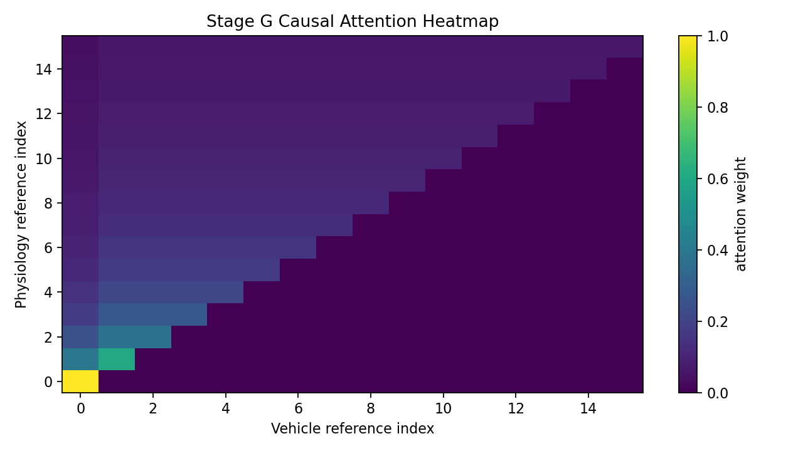
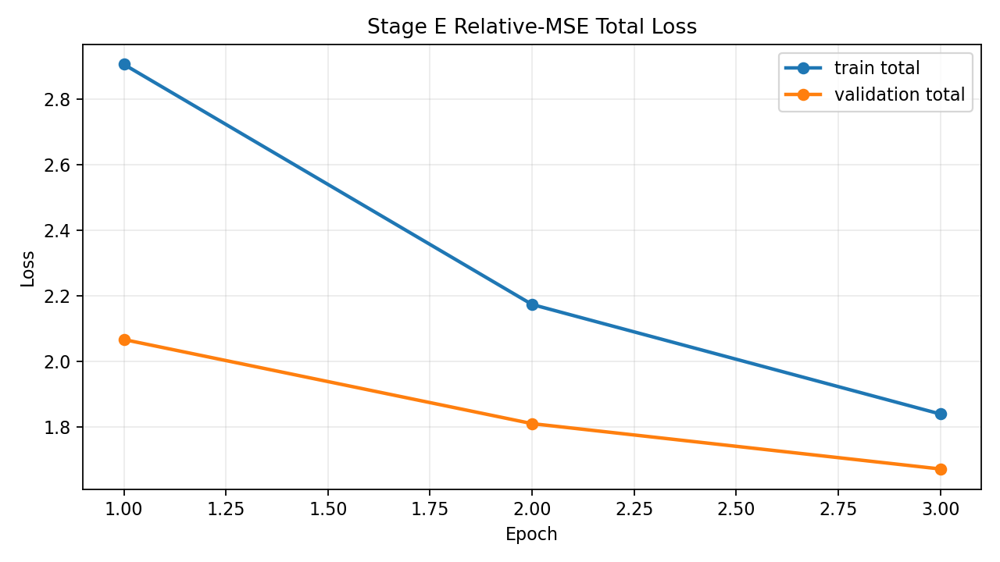
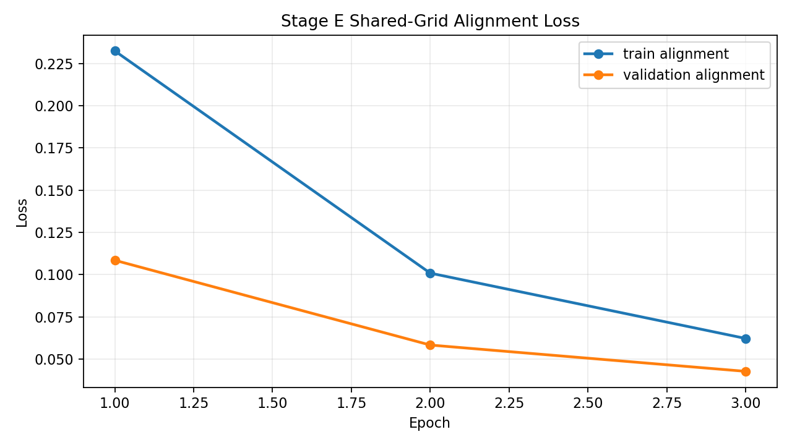
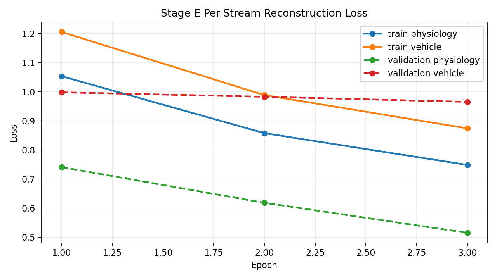
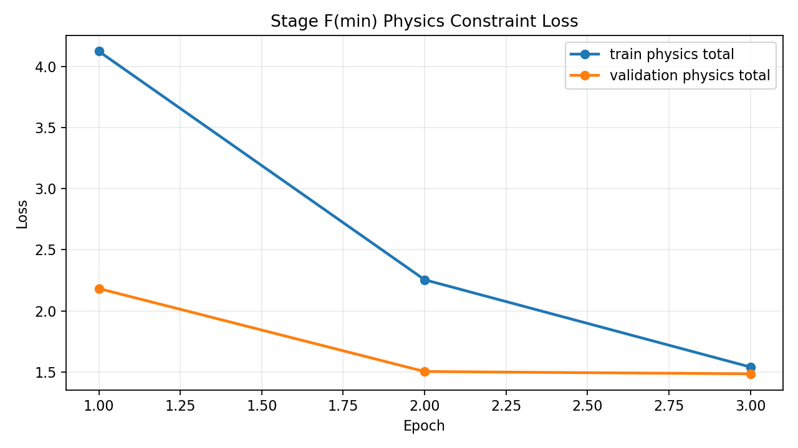
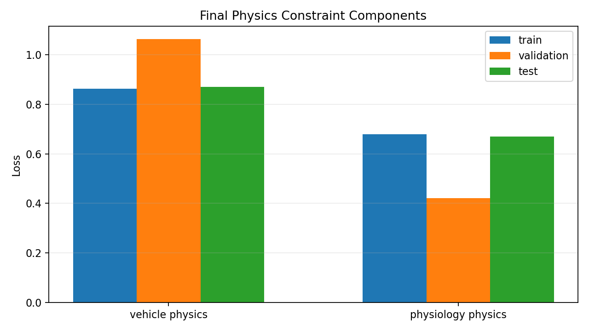
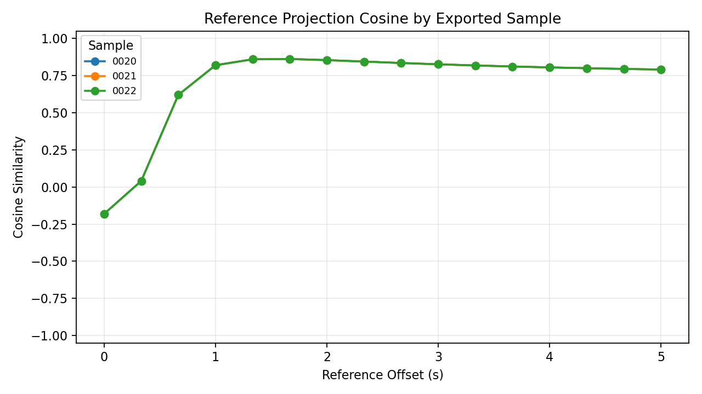

# Alignment Preview - 20251005_四01_ACT-4_云_J20_22#01

## Sample Summary

- sample count: `25`
- max physiology feature count: `12`
- max vehicle feature count: `21`

## Split Summary

- train: `15`
- validation: `5`
- test: `5`
- skipped between train/validation: `0`
- skipped between validation/test: `0`

## Final Train Metrics

- physiology reconstruction: `0.748968`
- vehicle reconstruction: `0.874629`
- reconstruction total: `1.623597`
- alignment: `0.062192`
- vehicle physics: `0.862109`
- physiology physics: `0.678538`
- physics total: `1.540647`
- total: `1.839854`

## Final Validation Metrics

- physiology reconstruction: `0.515433`
- vehicle reconstruction: `0.965805`
- reconstruction total: `1.481238`
- alignment: `0.042703`
- vehicle physics: `1.062895`
- physiology physics: `0.422128`
- physics total: `1.485024`
- total: `1.672444`

## Reference Intermediate Export

- partition: `test`
- exported sample count: `3`
- reference point count: `16`
- exported sample ids: `20251005_四01_ACT-4_云_J20_22#01:0020, 20251005_四01_ACT-4_云_J20_22#01:0021, 20251005_四01_ACT-4_云_J20_22#01:0022`
- physiology mean reference projection L2: `1.104787`
- vehicle mean reference projection L2: `0.951269`
- mean cross-stream projection cosine: `0.699514`

## Test Metrics

- physiology reconstruction: `0.596152`
- vehicle reconstruction: `0.976971`
- reconstruction total: `1.573123`
- alignment: `0.042703`
- vehicle physics: `0.869580`
- physiology physics: `0.670031`
- physics total: `1.539611`
- total: `1.769787`

## Physics Constraint Diagnostics

- enabled: `True`
- family: `full`
- mode: `feature_first_with_latent_fallback`
- vehicle metadata status: `loaded`
- vehicle metadata fields: `96`

| metric | train | validation | test |
| --- | ---: | ---: | ---: |
| vehicle physics | 0.862109 | 1.062895 | 0.869580 |
| physiology physics | 0.678538 | 0.422128 | 0.670031 |
| physics total | 1.540647 | 1.485024 | 1.539611 |

### Component Breakdown

| component | train | validation | test |
| --- | ---: | ---: | ---: |
| physiology_envelope | 0.000000 | 0.000000 | 0.000000 |
| physiology_latent | 0.314297 | 0.170024 | 0.170024 |
| physiology_pairwise | 0.022941 | 0.039361 | 0.042706 |
| physiology_smoothness | 0.341300 | 0.212743 | 0.457301 |
| physiology_spo2_delta | 0.000000 | 0.000000 | 0.000000 |
| vehicle_envelope | 0.000000 | 0.000000 | 0.000000 |
| vehicle_latent | 0.098659 | 0.070477 | 0.070477 |
| vehicle_semantic | 0.619351 | 0.953832 | 0.752882 |
| vehicle_smoothness | 0.144099 | 0.038587 | 0.046221 |

## Stage G Causal Fusion Diagnostics

- enabled: `True`
- partition: `test`
- state source: `hidden`
- sample count: `3`
- reference point count: `16`
- state dim: `32`
- fused dim: `96`
- mean attention entropy: `0.931446`
- mean max attention: `0.225623`
- mean causal option count: `8.500000`

### Event Contribution Samples

| sample | top event offset s | event score | top contribution offset s | contribution score |
| --- | ---: | ---: | ---: | ---: |
| `20251005_四01_ACT-4_云_J20_22#01:0020` | 4.333333 | 1.000000 | 0.333333 | 2.609973 |
| `20251005_四01_ACT-4_云_J20_22#01:0021` | 4.333333 | 1.000000 | 0.333333 | 2.609973 |
| `20251005_四01_ACT-4_云_J20_22#01:0022` | 4.333333 | 1.000000 | 0.333333 | 2.609973 |

### Stage G Artifacts

- summary json: `/home/wangminan/projects/chronaris/docs/reports/assets/alignment-preview-stage-g-min-closure-2026-04-22-stage-g-min/causal_fusion_summary.json`
- samples csv: `/home/wangminan/projects/chronaris/docs/reports/assets/alignment-preview-stage-g-min-closure-2026-04-22-stage-g-min/causal_fusion_samples.csv`

#### Causal Attention Heatmap

## Sample-Level Projection Diagnostics

- sample count: `3`
- reference point count: `16`
- mean projection cosine: `0.699514`
- min projection cosine: `-0.181241`
- max projection cosine: `0.861234`
- mean projection L2 gap: `0.212016`
- mean projection L2 ratio (vehicle/physiology): `0.875421`
- std projection cosine (cross-sample): `0.000000`
- cv projection cosine (cross-sample): `0.000000`
- std projection L2 gap (cross-sample): `0.000000`
- cv projection L2 gap (cross-sample): `0.000000`
- std projection L2 ratio (cross-sample): `0.000000`
- cv projection L2 ratio (cross-sample): `0.000000`

### Threshold Evaluation

- verdict: `PASS`

| check | actual | operator | expected | result |
| --- | ---: | :---: | ---: | :---: |
| sample_count | 3.000000 | >= | 1.000000 | PASS |
| mean_projection_cosine | 0.699514 | >= | 0.650000 | PASS |
| mean_projection_l2_gap | 0.212016 | <= | 0.250000 | PASS |
| mean_projection_l2_ratio_deviation | 0.124579 | <= | 0.300000 | PASS |
| projection_cosine_cv | 0.000000 | <= | 0.150000 | PASS |
| projection_l2_gap_cv | 0.000000 | <= | 0.250000 | PASS |

| sample id | mean cosine | min cosine | max cosine | mean L2 gap | mean L2 ratio |
| --- | ---: | ---: | ---: | ---: | ---: |
| 20251005_四01_ACT-4_云_J20_22#01:0020 | 0.699514 | -0.181241 | 0.861234 | 0.212016 | 0.875421 |
| 20251005_四01_ACT-4_云_J20_22#01:0021 | 0.699514 | -0.181241 | 0.861234 | 0.212016 | 0.875421 |
| 20251005_四01_ACT-4_云_J20_22#01:0022 | 0.699514 | -0.181241 | 0.861234 | 0.212016 | 0.875421 |

## Visual Artifacts

### Train/Validation Total Loss

### Train/Validation Alignment Loss

### Per-Stream Reconstruction Loss

### Train/Validation Physics Loss

### Final Physics Constraint Components

### Reference Projection Cosine

